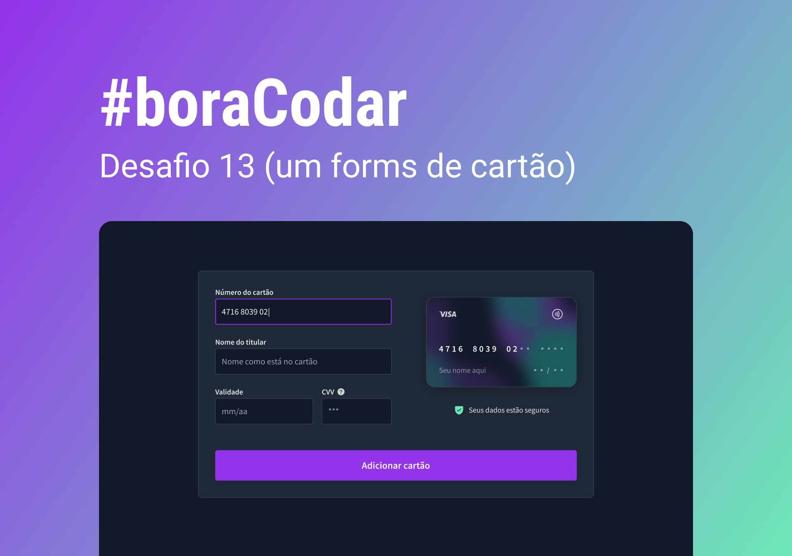

<h1 align="center"> #boraCodar Payment Page </h1>

This project is from #boraCodar event promoted by Rocketseat. This event is about weekly chalenges that helps developers evolve with new technologies.  

  <a href="#-tech">Tech</a>&nbsp;&nbsp;&nbsp;|&nbsp;&nbsp;&nbsp;
  <a href="#-project">Project</a>&nbsp;&nbsp;&nbsp;|&nbsp;&nbsp;&nbsp;
  <a href="#-layout">Layout</a>&nbsp;&nbsp;&nbsp;|&nbsp;&nbsp;&nbsp;
  <a href="#memo-licença">License</a>

  

 

  

## 🚀 Tech

This project was developed with the following technologies:

- HTML
- CSS
- JavaScript
- Git and Github
- Figma

## 💻 Project

This is a secure checkout page where the consumer would be able to put their credit card number.

- [Access the deploy of this project online](brunaporato.github.io/payment-page/)

## 🔖 Layout

Check the project layout on [Figma](https://www.figma.com/file/VnWYCjmGubKaSpkHJap4am/%23boraCodar---Desafio-13-(Community)?node-id=0-1&t=Gqy4Hc7KUMMNDjOy-0).

## :memo: License

This project is under MIT license.

---
 

Thank you for checking ♥ :wave:
 
< brunaporato / >

